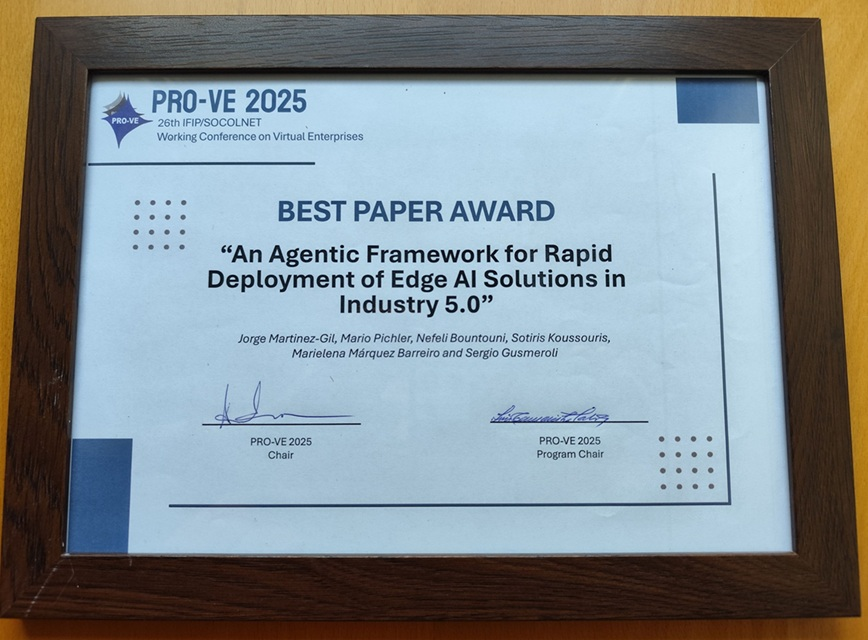

# Collaborative Intelligence Component


> **Official implementation of the Best Paper Award-winning framework at PRO-VE 2025.**

The **Collaborative Intelligence Component** is a web-based implementation of an **Agentic Framework for Industry 5.0**. It demonstrates a novel approach to **Human-in-the-Loop (HITL)** decision-making at the Edge, integrating Large Language Models (LLMs) to automate data curation and enable seamless, one-click model recalibration.



## 📄 Citation
If you use this code or framework in your research, **please cite the following paper**:

```bibtex
@inproceedings{martinez2025agentic,
  title={An Agentic Framework for Rapid Deployment of Edge AI Solutions in Industry 5.0},
  author={Martinez-Gil, Jorge and Pichler, Mario and Bountouni, Nefeli and Koussouris, Sotiris and Barreiro, Marielena M{\'a}rquez and Gusmeroli, Sergio},
  booktitle={Working Conference on Virtual Enterprises},
  pages={55--68},
  year={2025},
  organization={Springer}
}

```

## 🎥 Video Demonstration

Watch the system in action, featuring real-time MQTT data processing and ChatGPT 4o integration.

[https://www.youtube.com/watch?v=AR8F8U-QXhM](https://www.youtube.com/watch?v=AR8F8U-QXhM)

## 🔬 Scientific Contribution & Capabilities

This repository implements the "Collaborative Intelligence" layer described in the associated paper. It bridges the gap between static Edge AI models and dynamic industrial environments through:


### 1. Human-Machine Collaboration (Industry 5.0)

Unlike traditional "black box" deployments, this tool provides a **Dynamic Validation Interface** where human experts can review, correct, and curate AI predictions in real-time.

### 2. Agentic Reasoning & XAI

The system integrates **Generative AI (ChatGPT 4o)** to act as an intelligent agent. It not only labels data but provides **Explainable AI (XAI)** reasoning for _why_ a prediction was flagged as "OK" or "Non-OK," reducing the cognitive load on human operators.

### 3. Rapid Edge Recalibration

The component features an automated feedback loop. Validated data (from humans or the GenAI agent) is used to **recalibrate the Edge AI model** with a single click, allowing the system to adapt to data drift without offline retraining cycles.

### 4. Synthetic Data Augmentation

To address the data scarcity common in industrial settings, the system leverages LLMs to generate additional training samples based on expert-curated positive and negative examples.

## ⚙️ System Architecture

The solution follows a modular architecture designed for Edge deployment:

-   **Frontend:** Lightweight HTML/CSS/JS interface for low-latency interaction.
    
-   **Communication Layer:** MQTT-based telemetry (compatible with HiveMQ, Mosquitto) for real-time sensor streams.
    
-   **Intelligence Layer:**
    
    -   _Edge Model:_ Handles immediate inference.
        
    -   _Cloud Agent:_ Connects to GenAI APIs (Chatbase/OpenAI) for higher-order reasoning.
        
-   **Visualization:** Plotly.js for dynamic, real-time performance monitoring.
    

## 🚀 Usage Guide

### Prerequisites

-   Modern Web Browser (Chrome, Firefox, Edge).
    
-   Active MQTT Broker (e.g., HiveMQ).
    
-   Configuration file (see below).
    

### Quick Start

1.  **Launch:** Open `index.html` in your browser.
    
2.  **Configure:** Click **"Load Config"** and upload your `.json` mapping file.
    
3.  **Connect:** Click **"Connect to Broker"** to start the real-time MQTT stream.
    
4.  **Collaborate:**
    
    -   Monitor incoming predictions in the **Dynamic Table**.
        
    -   Use the **"GenAI"** button to auto-generate reasoning for anomalies.
        
    -   Manually correct targets if necessary.
        
5.  **Improve:** Click **"Recalibrate Model"** to update the edge model logic instantly.
    

### Configuration (`config.json`)

Strictly define your MQTT topics and feature vectors:

JSON

```
{
    "brokerURL": "wss://[broker.hivemq.com:8000/mqtt](https://broker.hivemq.com:8000/mqtt)",
    "inputTopic": "industry/edge/input",
    "outputTopic": "industry/edge/output",
    "inputs": [
        {"name": "Vibration_Sensor_X"},
        {"name": "Temperature_C"},
        {"name": "Pressure_PSI"}
    ]
}

```

## 🛠 Customization

-   **Styling:** Fully customizable CSS for white-labeling.
    
-   **Model Backend:** The JavaScript logic is modular; `predict()` functions can be swapped for TensorFlow.js or ONNX runtimes.
    

## 🤝 Acknowledgment

This work is supported by the **AI REDGIO 5.0** project: _"Regions and (E)DIHs alliance for AI-at-the-Edge adoption by European Industry 5.0 Manufacturing SMEs"_ under **EU Grant Agreement No. 101092069**.
